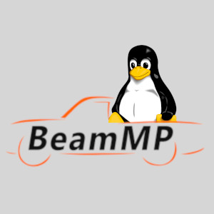
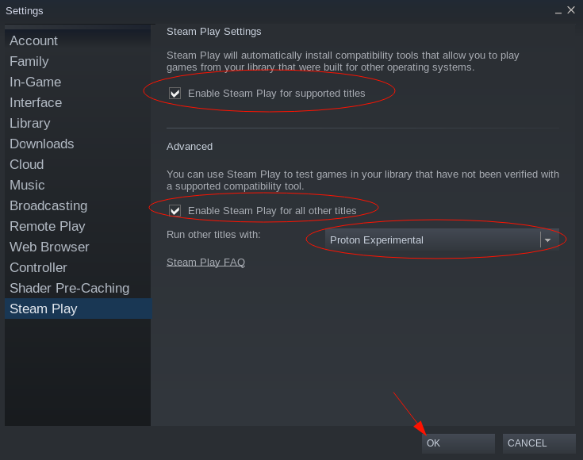

# Unoffical Linux BeamMP Installer

*Note: This project is intended to automate the installation of the BeamMP client on a Linux PC. If you are looking to install the BeamMP server, I would encourage you to go the BeamMP's official website and follow the instructions there. Link is at the bottom of the page.*



## Welcome

Do you like vrooming with friends? Does your Linux PC get jealous and make it difficult to run a multiplayer mod for BeamNG.drive? Do you lash out make the mod work anyway, but Linux sabotages you by filling the map with annoying black boxes? Me too!

Welcome to the Unoffical BeamMP Linux Installer! This program automates the installation of the BeamNG.drive multiplayer mod, BeamMP, on Linux using Proton, since the mod is natively available for Windows only.

This installer automates these things:
1. Installation of BeamMP into the BeamNG.drive Proton prefix
2. Installation of a custom BeamMP launcher that launches BeamMP using Proton Experimental
3. Creation of a new BeamMP desktop application entry that uses the custom launcher to launch the game. That way you open your start menu and click on the game to launch it.

## Dependencies
* wget
* unzip
* g++

## How to Install

### Video
[](https://youtu.be/KwrYt8Z76Xg)

### Written
1. You must install BeamNG.drive using Steam, if you haven't already.
2. If you haven't done so already, you also must install Proton Experimental. If you haven't, or you aren't sure if you have, you can do so through Steam and it is very easy. Follow these steps:
    
    a. Open Steam and click on the "Steam" button in the upper left, then click on "Settings".
    
    b. Click on "Steam Play" in the menu on the left. Make sure both check boxes are ticked and "Proton Experimental" is selected in the dropdown. (see photo)
    
    
    c. Click "OK". If it's not installed already, Steam will tell you that it needs to restart. Go ahead and let it do so. That's it! After Proton is installed, you do not need to have "Proton Experimental" selected in the dropdown anymore, but you will still need both check boxes ticked.

3. Now that BeamNG.drive and Proton are installed, run the following command in your terminal. It will ask you for your password:

    ```curl -L https://raw.githubusercontent.com/joshua-holmes/beammp-installer/main/install.sh | bash```

4. A window will pop up. Continue through the setup by clicking next until you see the "Finish" button. *Uncheck* the box so BeamNG.drive does not launch after installation and click "Finish". *If you leave this box checked before clicking "Finish", the BeamMP window that pops up will interrupt the installation of the custom launcher.*

5. BeamNG will now launch on it's own for around 10 seconds. Hit the "x" to close the window, or just wait until it does closes on it's own after about 10 seconds. This automated launch just ensures the BeamNG config files needed for BeamMP are set.

6. Once the command is finished running, BeamMP is installed! See below for how to run it. If you need to reinstall, simply start again from step 3. Running the script multiple times will not harm or bloat your computer.

## How to Run BeamMP After Installation
To run BeamMP, open your start menu on your desktop and search for and click on a program titled "BeamMP". It will have the same icon as BeamNG.drive.

If the desktop application entry failed to get created, you can launch the game by opening a terminal and running `beammp-launcher` from any directory.

## Credit
Here is a link to BeamMP's official website, and is the source of the mod:

[https://beammp.com/](https://beammp.com/)

## Made by
Joshua Holmes<br/>
[jpholmes.com](https://www.jpholmes.com)<br/>
[linkedin.com/in/joshua-phillip-holmes](https://www.linkedin.com/in/joshua-phillip-holmes/)<br/>
[github.com/joshua-holmes](https://github.com/joshua-holmes)<br/>
[joshua.phillip.holmes@gmail.com](mailto:joshua.phillip.holmes@gmail.com)